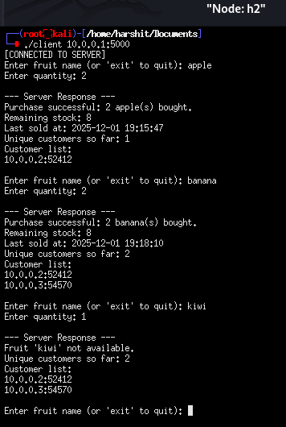
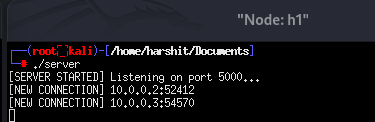
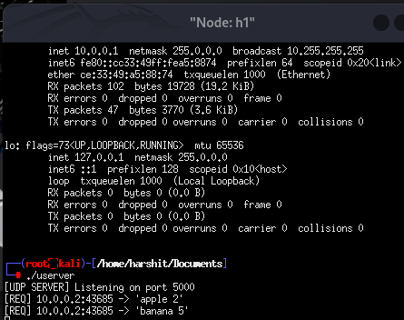

# CN_LAB
Assignments of CN lab

Assignment1: write a program to run TCP client and server socket programs where client first says "Hi" and in response server says "Hello"

Assignment2: Write a program using TCP socket to implement the following: i. Server maintains records of fruits in the format: fruit-name, quantity Last-sold, (server timestamp), ii. iii. Multiple client purchase the fruits one at a time, The fruit quantity is updated each time any fruit is sold, iv. Send regret message to a client if therequested quantityof the fruit is not available. v. Display the customer ids <IP, port> who has done transactions already. This list should be updated in the server every time a transaction occurs. vi. The total number of unique customers who did some transaction will be displayed to the customer every time.

Assignment 3: Same as Assignment 2 using UDP socket. .

